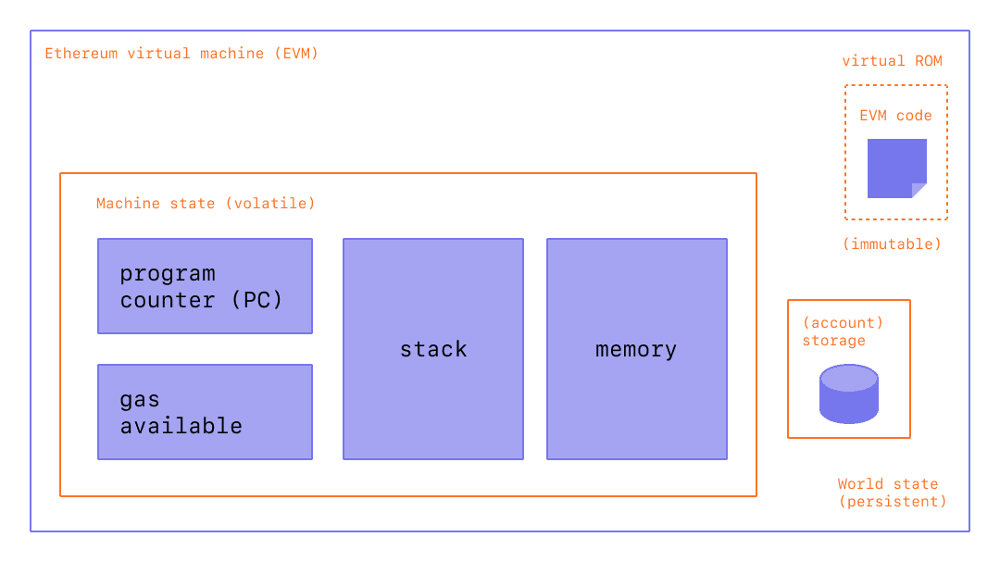

# Solidity Notes

## El Lenguaje Solidity

**Solidity** es un lenguaje de alto nivel orientado a contratos. 
Su sintaxis es similar a la de JavaScript y está enfocado específicamente a la Máquina Virtual de Etehreum (EVM). 
Solidity está tipado de manera fuerte y acepta, entre otras cosas, herencias, librerías 
y tipos complejos definidos por el usuario.



!!! Cite "Lecturas Recomendadas"
    https://github.com/ethereum/solidity  
    https://ethereum.org/en/developers/docs/evm/  
    https://blockgeeks.com/guides/smart-contracts/  

## Contratos
El código Solidity está encapsulado en contratos. Un contrato es el bloque de construcción más básico de las aplicaciones 
de Ethereum.


```solidity title="Estructura de un Contrato"
// agregar una licencia para producción. 
// SPDX-License-Identifier: GPL-3.0

// Version puede representar un rango. Ej >=0.7.0 <9.0.0
// o una version en particular ^5.0.0
pragma solidity >=0.7.0 <0.9.0;

// Declaración de un contrato, similar a una clase contract <Estructura>
contract Estructura {
    // Función de inicialización de un contrato
    constructor() {
        // Código de inicialización
    }
    
}
```
!!! Cite Lecturas Recomendadas
    Layout of a Solidity Source File — Solidity 0.5.8 documentation  
    https://docs.soliditylang.org/en/v0.5.8/layout-of-source-files.html  
    Remix - Ethereum IDE  
    https://remix.ethereum.org/  

## Variables y Tipos de Datos

!!! Info "Tipos de datos"  
    ``int | uint <8-256>``: Son números enteros, que pueden ser sin signo (`uint`) o con signo (`int`), 
    y que pueden tener una capacidad de 8 `int8` a 256 bits.  
    ``bool``: Verdadero o flaso  
    ``address``: Guarda direcciones de ETH de 160 bits (20 bytes), y puede tener métodos extra 
    como .transfer o .balance  
    ``string``: Cadena de texto  
    ``bytes<8-256>``: Cadena de bytes  

!!! Info "Tipos de variables"
    `locales`: Son aquellas que ocurren durante la ejecución en la EVM es la parte correspondiente a memoria volátil  
    `estado`: Son variables que se almacenan en la parte de la ROM de la EVM. Es memoria persistente, esto significa que 
    se escriben en la cadena de bloques (blockchain)

!!! Info "Variables globales"  
    ``msg``: Toda transacción es un mensaje firmado. En este objeto vienen los datos de dicho mensaje (sender, value, etc.)  
    ``tx``: Represena la transacción, es distitna respecto a msg porque cosas como el sender van variando conforme se concatenan llamadas entre contratos  
    ``block``: Información respecto al bloque  

```solidity title="Ejemplo"
// SPDX-License-Identifier: GPL-3.0

pragma solidity >=0.7.0 <0.9.0;

contract Estructura {
    
    int cantidad;
    uint cantidadSinSigno;
    address direccion;
    bool firmado;
    
    constructor(bool estaFirmado) {
        direccion = msg.sender;
        firmado = estaFirmado;
    }
    
}
```

!!! Cite "Lecturas Recomendadas"
    https://solidity-es.readthedocs.io/es/latest/types.html

## Operaciones Matemáticas
`Suma`: x + y  
`Resta`: x - y  
`Multiplicación`: x * y  
`División`: x / y  
`Módulo`: x % y (por ejemplo, 13 % 5 es 3, ya que al dividir 13 entre 5, 3 es el resto)  
`Exponencial`: x**y "x elevado a y"  

## Estructuras de datos

### Structs
!!! info "Structs"
    Son estructuras de datos complejas, que agrupan una serie de datos.  


```solidity title="Ejemplo"
struct Person {
  uint age;
  string name;
}
```

### Arrays
!!! Info "Arrays"
Hay dos tipos de arrays en Solidity: arrays fijos y arrays dinámicos:

```solidity title="Ejemplo"
// Un Array con una longitud fija de 2 elementos:
uint[2] fixedArray;
// otro Array fijo, con longitud de 5 elementos:
string[5] stringArray;
// un Array dinámico, sin longitud fija que puede seguir creciendo:
uint[] dynamicArray;
```

!!! Tip "También puedes crear arrays de estructuras."

```solidity title="Ejemplo"
Person[] people; // Array dinámico, podemos seguir añadiéndole elementos
```
Puedes declarar un array como público, y Solidity creará automaticamente una función getter para acceder a él. 
La sintaxis es así:

```solidity title="Ejemplo"
Person[] public people;
```
!!! Cite "Lecturas Recomendadas"
https://solidity-es.readthedocs.io/es/latest/types.html#tipos-de-referencia

### Trabajando con Arrays y Structs
```solidity title="Ejemplo"
// crear un nuevo Objeto `Person` del struct creado anteriormente
Person satoshi = Person(172, "Satoshi");

// añadir esta persona a nuestro array
people.push(satoshi);
```
version de una linea
```solidity title="Ejemplo"
people.push(Person(16, "Vitalik"));
```


### Maps

Los mapas son estructuras de datos de tipo llave-valor, que permiten apuntar un tipo de dato a otro en forma de diccionario.

El tipo de la llave puede ser cualquier tipo de dato elemental, (por ejemplo, uint), y el tipo de dato del valor puede ser cualquier dato elemental o complejo, (se pueden inclusive hacer estructuras multidimensionales)
````
mapping(<key type> => <value type>) <visibility> <name>;
````
### Enum
Representa una lista de valores posibles creados por el usuario, una variable del tipo de enum declarado sólo puede tomar los valores enumerados.
````
enum { <value1>, ..., <valueN> }
````

!!! Cite "Lecturas Recomendadas"
    https://platzi.com/clases/2561-smart-contracts/42824-arrays-y-mappings/
    https://solidity-es.readthedocs.io/es/latest/types.html#mappings

## Esturcturas de Control

``if/else``:
Estructura condicional. Ejecuta un bloque u otro dependiendo de una evaluación booleana
``for``:
Estructura cíclica que ejecuta un bloque de instrucciones un número determinado de veces
``while``:
Estructura cíclica que repite un bloque mientras se cumpla una condición
``do while``:
Estructura cíclica que se asmilia al while, con la diferencia que siempre se ejecuta almenos una vez

## Eventos
Los eventos son un tipo de dato que sirve para emitir avisos de que ocurrió alguna acción en particular.

Puede ser utilizado por clientes para escuchar cambios importantes, y también pueden utilizarse para indexar información.

Protocolos como TheGraph utilizan indexación de eventos para agregación de información

!!! Cite "Lecturas Recomendadas"
    https://platzi.com/clases/2561-smart-contracts/42820-eventos/

## Funciones

Son piezas de código definidas por un nombre, parámetros y modificadores.

!!! Info "Estructura"
    `name`: Nombre de la función   
    `type`: Tipo de dato   
    `parameter`: Nombre del parámetro ()   
    `access modifier`: public, private, internal, external   
    `mutability modifier`: view, pure. Ambas hacen que la función no cobre gas, y si se omite, se asume que es 
    una función que escribe en el storage de la EVM   
    `user defined modifiers`: Son modificadores definidos por el usuario, son opcionales y se presentan en la siguiente 
    clase   
    `returns`: Indica que la función retornará uno o más datos  
````
function <name>(<type> <parameter>, <type> <parameter>[..., ]>) 
  <access modifiers>
  <mutability modifiers>
  <user defined modifiers> 
  <returns>(<type>) {
    <content>
}
````
```solidity title="Ejemplo"
function eatHamburgers(string _name, uint _amount) {
}
```
!!! tip
    La convención (no obligatoria) es llamar los parámetros de las funciones con nombres que empiezan 
    con un guion bajo (_) para de esta forma diferenciarlos de variables globales. 
    Se recomienda usar esta convención.

!!! Info "Access modifier"
    ``public``: son accesibles desde todo ámbito posible.  
    ``private``: solo son accesibles desde el mismo contrato.  
    ``internal``: solo son accesibles desde el mismo contrato y sus contratos derivados.  
    ``external``: solo accesibles desde fuera del contrato.  

!!! Info "mutability modifier"
    ``view``: funciones para leer datos del contracto. Por ejemplo para acceder a una variable privada y retornarla.  
    ``Pure``: funciones que no modifican datos del contrato pero devuelven algo realizazdo con esos datos por ejemplo 
    una suma.  

!!! Tip "Algunos puntos a pulir:"
    Las funciones pure. No leen ni modifican variables de estado y tampoco usan ninguna variable global.
    Existen funciones payable. Estas se usan cuando la función envía ether a alguna dirección en la blockchain. 
    Solo las funciones con tipo de retorno “payable” están habilitadas para enviar ether.
    Convenciones no obligatorias
    En el desarrollo Solidity existe una convención no obligatoria y es que todos los parámetros de una función empiecen 
    con guión bajo.  

## Modificadores
Los modificadores son funciones especiales creadas por el usuario y que se añaden a otra función para envolver su funcionamiento. Algo parecido a un midlewere

Permiten ejecutar codigo al inicio de una funcion y por lo general estan ligados a la restriccion de permisos para que solo el owner, quien hizo el deploy tenga acceso.

````
modifier <name>(<type> <parameter>..., [,...]) {
  <content>
}
````

!!! Info "El guión bajo"
    El guión bajo (también conocido como placeholder), es una instrucción especial del modificador que indica dónde se va a ejecutar el código de la función inicial que envuelve al modifier.

Por ejemplo:
````
## Primero valida y luego ejecuta
modifier isOwner() {
  if(<condicion>) revert()
  _;
}

## Primero ejecuta y luego valida
modifier isOwner() {
   _;
  if(<condicion>) revert()
}

## Ejecuta, valida y vuelve a ejecutar
modifier isOwner() {
   _;
  if(<condicion>) revert()
   _;
}
````
La función revert() se utiliza para arrojar una excepción en nuestro smart contract y revertir la función que la llama. Se puede agregar un mensaje como parámetro describiendo el error.
````
modifier EsOwner() {
        if (msg.sender != owner) revert("Solo el dueño del contrato puede modificarlo.");
        _;
    }
````
Dentro de un modificador de función se puede añadir toda la lógica que necesitemos, no se limita a una sola validación, se pueden usar estructuras require dentro de las mismas:
````
require( msg.sender == owner, "Solo el propietario puede cambiar el nombre del proyecto." );
````
Y de este modo añadir más validaciones o mecanismos de validación diferentes, podemos ver al modificador como una función que permite la ejecución de otra función siempre y cuando todas sus validaciones sean superadas.

## Errores

Manejo de errores  
``assert``: Se utiliza para pruebas, compara dos valores.  
``revert``: Es un error que regresa todas las modificaciones de estado realizadas durante la ejecución de la función. Recibe por parámetro un mensaje de error.  
``require``: Es una variación del revert que recibe por parámetro una expresión booleana y revierte si esta expresión es falsa.

Cabe destacar que cualquier consumo de gas ejecutado hasta el momento de un revert se debe pagar, porque el cómputo fué utilizado

**Ejemplos**

usando If
```solidity 
modifier IsOwner() {
    if (msg.sender != owner) revert();
    _;
}
```
Usando require()
````
modifier IsOwner() {
    require(msg.sender == owner, "El usuario no es el creador del contrato");
    _;
}
````

!!! Cite "Lecturas Recomendadas"
    https://medium.com/blockchannel/the-use-of-revert-assert-and-require-in-solidity-and-the-new-revert-opcode-in-the-evm-1a3a7990e06e#:~:text=which%20is%20appropriate.-,Use%20require()to%3A,-Validate%20user%20inputs

## Tipos de Almacenamiento

**Tipos de almacenamiento**
``Storage``: Memoria persistente. Es el más costoso. Similar a la memoria ROM  
``Memory``: Variables temporales durante ejecución. Se asimila a la RAM  
``Calldata``: Son constantes definidas en el entorno de ejecución de una variable. No son modificables.

**Memoria dinámica**
La razón por la que un string necesita un sufijo que indique el uso de memoria, es debido a que es memoria dinámica, por lo que calldata no puede alocar una cantidad definida de memoria, por lo que tenemos que indicarle que esa variable la pase por la memoria volátil (RAM/memory), para que la función la pueda manejar correctamente.

Este efecto ocurre con cualquier cosa que sea de tamaño no definido, por ejemplo:

- Un arreglo
- Un string

Storage:
Hace referencia a todos los datos guardados permanentemente en la blockchain. ¿Pero cuáles son estos datos? Las variables de nuestro contrato que hayan sido declaradas en el scope global fuera de cualquier método (función del contrato), a esto se le denomina el ESTADO de nuestro Smart Contract. Puedes entenderlo como los datos del disco duro de tu ordenador, solo que están en la blockchain, esto es, descentralizados en millones de discos duros u otros dispositivos de almacenamiento persistente (nodos).

## Gas y Comisiones

Gas y comisiones
El gas es una unidad de medida para el procesamiento de la EVM. Se mide en unidades de gas, y es constante para las mismas operaciones.

``gasPrice``: Es la cantidad de ETH que pagamos por unidad de gas. Es decir, aunque el gas sea constante, la demanda por ese gas puede subir el precio.
``gasCost``: Es la cantidad de unidades de gas que generó la ejecución
``gasFee``: Gas cost * Gas Price

**Priority fee**
A partir del EIP1559 , se realizaron cambios importantes al mercado de gas, y se contempla el priority fee, que es el extra que menciona Sebastián, y es una propina para el minero con la cuál se obtiene prioridad en la ejecución.


!!! Cite "Lecturas Recomendadas"
    https://ethgasstation.info/
    https://ethereumprice.org/gas/


## Transferencias de ether desde un contrato

``send``: Envía un monto a una dirección y retorna false si la transferencia no se realiza  
``transfer``: Envía un monto y revierte si no se puede realizar  
``call``: Esta es más complicada, pero básicamente realiza una llamada hacia una dirección. Incluso se pueden llamar funciones de otro contrato si se le pasa un address válido y la llamada dentro del parámetro data. No obstante, al ser un mensaje, puede llevar ether, y por eso se usa para envíos. Retorna el resultado de la función llamada (si es que fué el caso).

Un wei es la unidad más pequeña de Ether.

1 ETH == 10^18 WEI == 1,000,000,000,000,000,000 WEI

## Recibir ether desde un contrato

``Receive``: Recibe el saldo de trasferencias sin parámetros.  
``FallBack``: Recibe información adjunta a la trasferencia por medio de los parámetros.  
``Payable``: Se especifica el tipo payable a una función que puede recibir trasferencias.

__Lecturas Recomendadas__
Sin lectura Recomendada

## Capitulo 16: Manejo de dependencias y librerías

!!! Cite "Lecturas Recomendadas"
    https://github.com/OpenZeppelin/openzeppelin-contracts/blob/master/contracts/utils/math/SafeMath.sol

## Herencias
“No hay que reinvetar la rueda”

Utilizamos la Herencia para reutilizar codigo en nuevos contratos.  
``is``. Si un contrato tiene un constructor con parametros, debemos indicar que valores debe tomar ese constructor para poder derivarse.

Entonces, se busca generar una relacion entre contratos para reutilizar el codigo mediante la Herencia. Por lo que la capacidad de agregar/modificar una funcion ya escrita en el contrato anterior nos sera de mucha utilidad.

``virtual``: se utiliza para identificar un contrato que puede ser heredado.
``override``: para sobreescrivir una funcion de un contrato heredado se usa la palabra.

contacto abstracto es lo mismo que una clase abstracta.

Las ``interfaces`` no van a tener codigo. su funcion es indicarnos un comportamiento que queremos que tenga un contrato. Solo tiene declaraciones (definiciones de funciones) sin codigo.

``super`` (sentencia) nos sirve para hacer referencia a una funcion de clase superior.

Ejemplo practico: Buscamos 2 funciones virtuales en Modificadores📗 e Interface📘 para colocar en nuestro archivo/contrato de Herencia 📕📘📗.

Vamos a tener que importar el directorio de los demas contratos, en este caso se encuentran en la misma carpeta los contratos. Coloco los emojis de libros para hacer referencia a un contrato, si hay varios libros es porque es una Herencia que contiene otros contratos.

Herencia.sol 📕📘📗

````
// SPDX-Licence-Identifier: UNLICENSED

pragma solidity >=0.7.0 < 0.9.0;

import "./Interface.sol";
import "./Modificadores.sol";

contract Herencia is Suma, Modificadores {

    constructor(string memory nombreNuevo) Modificadores(nombreNuevo) {

    }

    function sumar(uint numero1, uint numero2) public override EsOwner() view returns(uint) {
        return numero1 + numero2;
    }
}
````
Es buena practica traer todo el encabezado de la funcion de “Interface”, por lo que es recomendable copiar y pegar “function sumar(uint numero1, uint numero2)”

Interface.sol 📘
````
// SPDX-Licence-Identifier: UNLICENSED

pragma solidity >=0.7.0 < 0.9.0;

interface Suma {

    function sumar(uint numero1, uint numero2) external returns (uint);
}
````
Modificadores.sol 📗
````
// SPDX-Licence-Identifier: UNLICENSED

pragma solidity >=0.4.0 < 0.9.0;

contract Modificadores {


    address private owner;
    string private nombreOwner;

    constructor(string memory nombre {
        owner = msg.sender;
        nombreOwner = nombre;
    }

    function Suma(uint numero1, uint numero2) public view EsOwner() returns (uint) {
        return numero1 + numero2;
    }

    modifier EsOwner() {
        if (msg.sender != owner) revert();
        _;
    }
}
````
## Polimorfismo
Capacidad de poder utilizar contratos deployados y sus contratos superiores o funciones de los mismos en nuestro contrato.

Polimorfismo es una propiedad de la POO que permite (a nivel general digamos) enviar mensajes iguales a objetos de diferentes tipos.

En limpio: tus objetos deben de “saber” responder al mensaje que les estás enviando, esta es la propiedad polimórfica.

No tiene nada qué ver con contratos ni nada por el estilo, es puramente un tema de objetos


## Tokens
‍Un token es un objeto físico o digital que tiene valor en cierto contexto o para determinada comunidad, aunque su propia materialidad no contenga ese valor en sí.

Las fichas de casino, por ejemplo, son solo pedazos de plástico de distintos colores, pero representan cantidades de dinero. Algunas, hasta millones de dólares, aunque fabricar una de ellas cueste apenas centavos.

Eso hacen los tokens: representan otra cosa, están en su lugar. ¿Por qué? Hay muchos motivos: la comodidad, la seguridad, la facilidad de transportarlos o transferirlos.

En el mundo cripto, los tokens se generan a partir de piezas de código de programación, en formato de contratos inteligentes que corren sobre la blockchain. El smart contract describe cómo funciona cada token. La base de datos lleva el registro de cuántos tiene cada quien. Y los usuarios pueden enviárselos entre sí como forma de transferirse valor.

!!! Cite "Lecturas Recomendadas"
    Estandares Tokens no Fungibles:  
    https://github.com/OpenZeppelin/openzeppelin-contracts/blob/master/contracts/token/ERC721/ERC721.sol
    Estandares Tokens Fungibles:  
    https://github.com/OpenZeppelin/openzeppelin-contracts/blob/master/contracts/token/ERC20/ERC20.sol  

## Application Binary Interface (ABI)


!!! Cite "Lecturas Recomendadas"
    https://docs.ethers.io/v5/api/utils/abi/
    https://web3js.readthedocs.io/en/v1.2.11/web3-eth-abi.html#eth-abi
